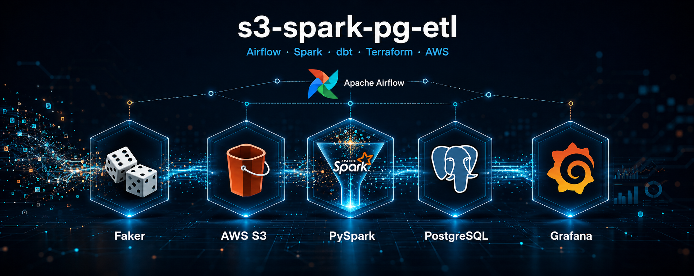
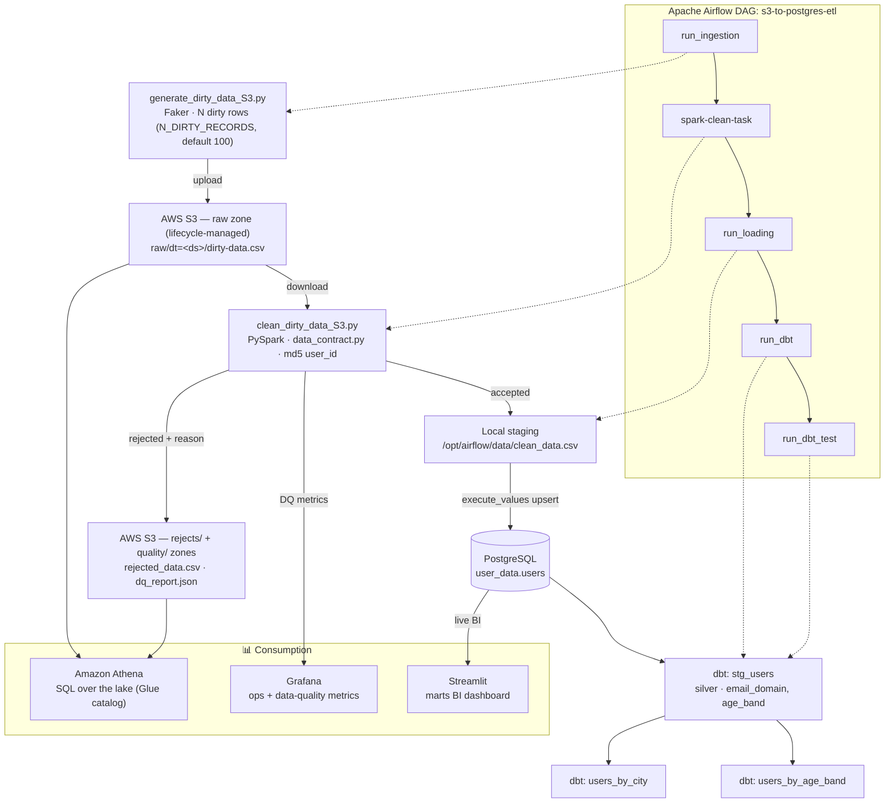
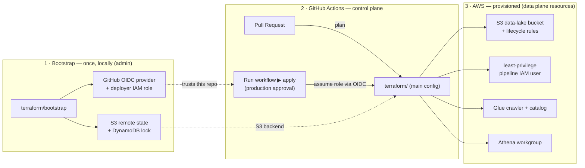
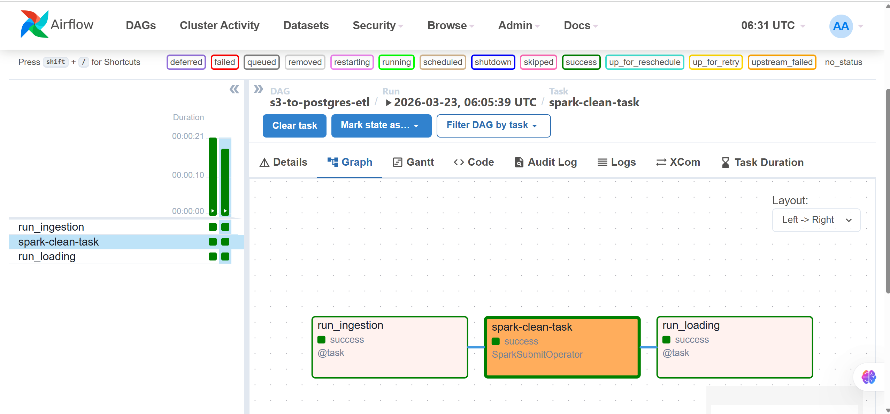
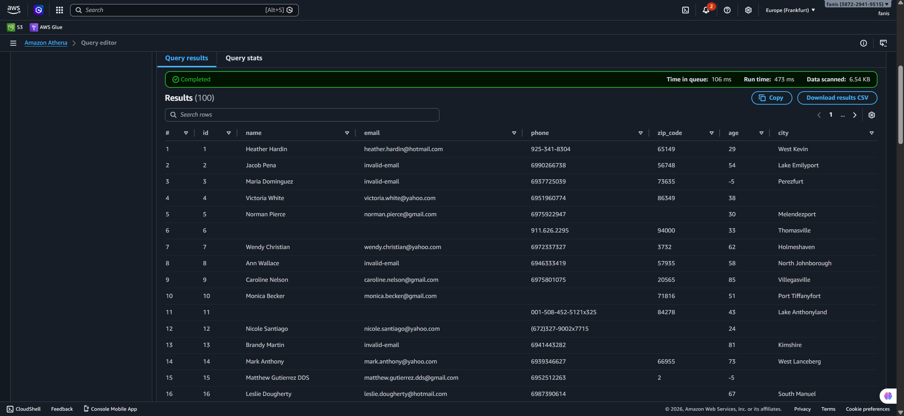
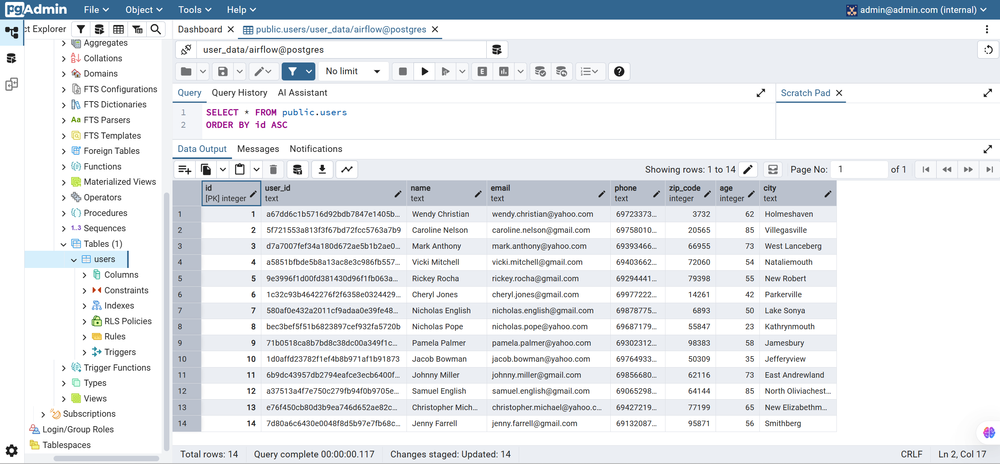

<div style="background-color:#fff8e7; color:#2b2b2b; padding:20px; border-radius:10px;">

# 🚀 Contract-Driven Data Pipeline

> An end-to-end, containerized ETL platform where a declarative **data contract** is the single source of truth — driving validation, rejection lineage, and PII classification.
> **Faker → AWS S3 → PySpark → PostgreSQL → dbt**, orchestrated by **Airflow**, provisioned with **Terraform**, observed in **Grafana**.



An automated, containerized ETL (Extract, Transform, Load) pipeline orchestrated by `Apache Airflow`. The project generates mock "dirty" data, uploads it to `AWS S3`, cleans it with `PySpark` against a declarative data contract, bulk-loads it into `PostgreSQL`, and builds analytics marts with `dbt`. The AWS side is provisioned with `Terraform` (least-privilege IAM, Glue + Athena), and the pipeline is monitored in `Grafana`.

[](https://github.com/theofanis-tsakanikas/contract-driven-data-pipeline/actions/workflows/ci.yml)
[](LICENSE)


---

## 💡 Why This Project

This is an end-to-end **data engineering** portfolio project that demonstrates a modern,
production-minded analytics stack running entirely on a local machine via Docker. It shows:

- **Pipeline orchestration** — an Airflow DAG (TaskFlow API) coordinating ingestion,
  transformation, loading, and analytics, with retries and a clear task lineage.
- **Distributed data processing** — PySpark schema enforcement, regex/null validation,
  type casting, and deterministic surrogate-key generation (MD5 hashing).
- **Cloud object storage** — programmatic S3 ingestion with boto3 and least-privilege IAM.
- **High-performance loading** — bulk upserts into PostgreSQL with `execute_values` and
  idempotent `ON CONFLICT` semantics.
- **Analytics engineering** — a dbt silver/marts layer (staging view + aggregate marts)
  with tests, isolated from Airflow's dependencies.
- **Infrastructure as Code** — Terraform provisions the AWS side (data-lake bucket +
  lifecycle, least-privilege pipeline IAM user, Glue crawler + Athena), with a one-time
  bootstrap for remote state and a GitHub Actions **apply button** authenticated via OIDC
  (no stored AWS keys).
- **Query the lake** — Glue catalogs the S3 zones (`raw`/`rejects`/`quality`) so you can
  run **Athena** SQL straight over the lake, including a data-quality history.
- **Observability** — Airflow StatsD metrics flow to Prometheus and a provisioned
  **Grafana** dashboard (run durations, task outcomes, and **data-quality** trends such
  as accept-rate and rejections-by-reason).
- **BI** — a **Streamlit** dashboard over the marts (live Postgres or a self-contained demo).
- **Reproducibility & quality** — connections-as-code, a containerised stack, a `Makefile`
  front door, unit tests for the transform, ruff linting, and a CI pipeline (lint + PySpark
  tests + a Postgres smoke test + DAG-validate).

> New here? Start with the [Data Lineage](#-data-lineage) diagram, then the
> [Installation & Setup](#-installation--setup). For an engineering deep-dive, see
> [CLAUDE.md](CLAUDE.md).

## 📑 Table of Contents

- [Why This Project](#-why-this-project)
- [Architecture Overview](#-architecture-overview)
  - [Data Lineage](#-data-lineage)
- [Database Architecture: Local vs Production Mindset](#-database-architecture-local-vs-production-mindset)
- [Security & AWS IAM Configuration](#-security--aws-iam-configuration)
- [Project Structure](#-project-structure)
- [Tech Stack & Prerequisites](#-tech-stack--prerequisites)
- [Installation & Setup](#-installation--setup)
- [ETL Pipeline Breakdown](#-etl-pipeline-breakdown)
- [Monitoring UIs](#-monitoring-uis)
- [Pipeline Execution & Monitoring](#-pipeline-execution--monitoring)

---

## 🏗️ Architecture Overview

The Airflow DAG runs five tasks in order — `run_ingestion → spark-clean-task → run_loading → run_dbt → run_dbt_test`:

1. **Ingestion (Python & Boto3):** Generates synthetic dirty data with Faker (default 100 rows, configurable via `N_DIRTY_RECORDS`) and uploads the raw CSV to AWS S3 under a date-partitioned key (`raw/dt=<ds>/dirty-data.csv`). The bucket is **provisioned by Terraform** (the pipeline only writes objects — no `s3:CreateBucket`), and the raw zone is **retained** under a lifecycle rule for an auditable history. Credentials come from the `aws_default` Airflow connection (`S3Hook`).
2. **Transformation (PySpark & SparkSubmitOperator):** Spark pulls the raw CSV from S3 and enforces the declared [data contract](docs/governance/DATA_DICTIONARY.md). Valid rows are cleaned (MD5 pseudonymised `user_id`) and loaded; **rejected rows are quarantined with their `rejection_reason`** (lineage) and a per-run **data-quality report** (`dq_report.json`) is written, logged, **emitted to Grafana** as metrics, and uploaded back to S3 (`rejects/` + `quality/` zones).
3. **Loading (Python & Psycopg2):** Performs an efficient bulk insert using `execute_values` into PostgreSQL with upsert logic (`ON CONFLICT DO NOTHING`), using the `postgres_default` Airflow connection.
4. **Analytics (dbt):** `run_dbt` builds the silver/marts layer (`stg_users` → `users_by_city`, `users_by_age_band`); `run_dbt_test` runs the schema tests, so a bad load fails the DAG instead of publishing broken marts.

> **Note on Production vs Local Testing:** In a standard Cloud Production environment, Spark would read directly from S3 using s3a/s3n protocols and write directly to the database via a JDBC connector. For local testing, isolation, and cost-efficiency purposes, this pipeline downloads the data locally to clearly separate and monitor the three distinct ETL stages.

### 🧬 Data Lineage

End-to-end flow from raw S3, through the cleaning contract, to the dbt analytics layer
and its **consumers** (Athena over the lake, Grafana for quality/ops, Streamlit BI).
The dotted arrows map each Airflow task to the stage it drives.



### 🏗️ Infrastructure & Deployment (control plane)

Kept **separate from the data lineage on purpose** — provisioning has a different
lifecycle than the data flow. Terraform manages the AWS side; a one-time bootstrap
creates the remote state + a GitHub OIDC role, and the main config is applied either
locally or from a manual GitHub Actions button (no stored AWS keys).



> The ETL itself is **not** run from GitHub — that is Airflow's job (the data plane).
> GitHub provisions/deploys infra; Airflow runs the pipeline.

---

## 🗄️ Database Architecture: Local vs Production Mindset

For this project, we spin up a **single PostgreSQL container** acting as a unified database instance. However, inside this instance, we create two completely isolated logical databases to simulate a real-world enterprise environment:

1. **POSTGRES_DB (airflow):** Dedicated solely to Airflow's internal metadata (DAG runs, task states, triggers).
2. **TARGET_DB (user_data):** Our analytics data warehouse where the cleaned Spark data is loaded.

> **Why this design?**
> * **Local Efficiency:** Running one Postgres container saves RAM and CPU on local machines compared to spinning up two heavy database servers.
> * **Production Ready:** In a real cloud production environment (e.g., AWS RDS), these two would be **physically separated servers with different endpoints and credentials** for maximum security and performance isolation. If you want to move to production, you just change the `DB_HOST` in the `.env` file—no code changes required!

---

## 🔐 Security & AWS IAM Configuration

The pipeline's AWS identity is **managed by Terraform** (`infra/terraform/iam.tf`) — you don't create it by hand:

* **Dedicated least-privilege IAM user:** Terraform creates a user whose policy allows *only* `s3:ListBucket` on the data-lake bucket and `s3:GetObject`/`s3:PutObject` on its objects — no `CreateBucket`, no `DeleteObject`, no access to anything else.
* **Access keys as outputs:** `terraform output pipeline_access_key_id` / `pipeline_secret_access_key` — drop them into your `.env` (gitignored).
* **No stored keys in CI:** the Terraform GitHub Actions workflow authenticates to AWS via **OIDC** (a deployer role created by the one-time bootstrap), so there are no long-lived AWS keys in GitHub.
* **Two distinct identities:** the *pipeline* user (read/write objects) is separate from the *deployer* role (provisions infra) — never reuse one for the other.

---

## 🗂️ Project Structure

The repository is organized following standard Data Engineering folder conventions:
```text
contract-driven-data-pipeline/
├── dags/             # Airflow DAG (TaskFlow API) — dag_id: s3-to-postgres-etl
├── scripts/          # ETL stages: generator, data_contract, PySpark clean, loader
├── dbt/              # dbt silver/marts layer (stg_users → users_by_city / _age_band)
├── docs/governance/  # Generated DATA_DICTIONARY.md (contract + PII classification)
├── infra/
│   ├── docker-compose.yml         # the full local stack
│   ├── Dockerfile.airflow/.spark  # arch-aware (amd64 + arm64) images
│   ├── observability/             # Prometheus + Grafana (provisioned dashboard) + statsd mapping
│   └── terraform/                 # IaC: bucket + lifecycle, least-priv IAM, Glue, Athena
│       └── bootstrap/             # one-time: remote state + lock + GitHub OIDC role
├── app/              # Streamlit marts BI dashboard (live Postgres or demo)
├── tests/            # pytest unit tests (transform, contract, loader, DAG integrity)
├── Makefile          # dev front door: make up / run / tf-apply / crawler / app ...
├── .github/workflows/ ci.yml (lint+test+smoke+dag-validate) · terraform.yml (plan/apply, OIDC)
├── data/  logs/      # runtime mounts (gitignored)
├── .env / .env.example
├── LICENSE
└── README.md
```
---

## 🛠️ Tech Stack & Prerequisites

| Technology | Purpose | Key Libraries Used |
| :--- | :--- | :--- |
| Apache Airflow 2.11 | Pipeline Orchestration | TaskFlow API, SparkSubmitOperator, S3Hook |
| Apache Spark 3.5.2 | Distributed Processing & Cleaning | pyspark, pyarrow |
| AWS S3 / Boto3 | Cloud Object Storage (data lake) | boto3, botocore |
| PostgreSQL 16 | Target Relational Database | psycopg2-binary, execute_values |
| dbt 1.8 (postgres) | Analytics / marts (silver-gold) | dbt-core, dbt-postgres |
| Terraform | IaC: bucket, IAM, Glue, Athena (+ OIDC) | hashicorp/aws ~> 5 |
| Glue + Athena | Catalog + SQL over the S3 lake | Glue crawler, Athena workgroup |
| Prometheus + Grafana | Pipeline & data-quality observability | statsd-exporter, provisioned dashboards |
| Streamlit | Marts BI dashboard | streamlit, plotly |
| Docker & Compose | Multi-container Infrastructure | CeleryExecutor, Redis Broker |

**Prerequisites:**
* Docker and Docker Compose installed.
* Python 3.12+ (for local development).
* An AWS account + Terraform and AWS CLI (to provision the bucket/IAM/Glue/Athena).

---

## ⚙️ Installation & Setup

Follow these steps to run the pipeline locally on your machine:

**1. Clone the repository**
```bash
git clone https://github.com/theofanis-tsakanikas/contract-driven-data-pipeline.git
cd contract-driven-data-pipeline
```

**2. Provision the AWS side with Terraform**
One-time bootstrap (remote state + lock + GitHub OIDC role), then the main infra (bucket + IAM + Glue + Athena). See [infra/terraform/README.md](infra/terraform/README.md).
```bash
make bootstrap-apply          # once, with admin creds
make tf-apply                 # creates bucket, least-priv IAM user, Glue, Athena
make tf-output                # → S3_BUCKET_NAME + pipeline AWS keys for .env
```
> Prefer a button? Open a PR for `terraform plan`, then run the **Terraform** GitHub Action (`apply`, OIDC). The pipeline itself runs in Airflow, never from CI.

**3. Configure Environment Variables**
Create a `.env` at the repo root (copy from `.env.example`); fill the AWS values from `make tf-output`:

```bash
# === 🗄️ PostgreSQL Instance Settings (Database) ===
DB_USER=your_db_user
DB_PASS=your_db_password
DB_HOST=airflow-docker-postgres-1
DB_PORT=5432

# === 🎯 Databases ===
POSTGRES_DB=airflow           # Airflow Internal Metadata
TARGET_DB=user_data           # Your cleaned analytics data
DEFAULT_DB=postgres

# === 🌐 Airflow Web UI Admin ===
AIRFLOW_ADMIN_USER=your_web_admin_user
AIRFLOW_ADMIN_PASSWORD=your_web_admin_password
AIRFLOW_ADMIN_EMAIL=admin@example.com

# === 📊 PgAdmin UI Credentials ===
PGADMIN_MAIL=admin@example.com
PGADMIN_PASS=your_pgadmin_password

# === 📈 Grafana UI (optional; defaults admin/admin) ===
GRAFANA_USER=admin
GRAFANA_PASS=your_grafana_password

# === ☁️ AWS S3 Configuration ===
AWS_ACCESS_KEY_ID=YOUR_AWS_ACCESS_KEY_ID
AWS_SECRET_ACCESS_KEY=YOUR_AWS_SECRET_ACCESS_KEY
AWS_DEFAULT_REGION=eu-central-1
S3_BUCKET_NAME=your-s3-bucket-name
# Fallback key — the DAG overrides this per run with raw/dt=<ds>/dirty-data.csv
S3_FILE_KEY=raw/dirty-data.csv

# === 📂 Local Staging Paths ===
# N_DIRTY_RECORDS = how many rows ingestion generates (default 100; bump for a fuller demo)
N_DIRTY_RECORDS=100
LOCAL_DIRTY_PATH=/opt/airflow/data/dirty_data.csv
LOCAL_CLEAN_FOLDER=/opt/airflow/data/clean_data
LOCAL_CLEAN_PATH=/opt/airflow/data/clean_data.csv
# Rejected rows (with rejection_reason) + the per-run data-quality summary
LOCAL_REJECTS_PATH=/opt/airflow/data/rejected_data.csv
DQ_REPORT_PATH=/opt/airflow/data/dq_report.json

# === 🐳 Docker Container Permissions ===
AIRFLOW_UID=1000
AIRFLOW_GID=0
```

**4. Build and Spin Up the Stack**
```bash
make up          # = docker compose --env-file .env -f infra/docker-compose.yml up --build -d
```

*Note: The init.sh entrypoint automatically runs `airflow db init`, creates the Airflow admin user from your `.env`, and sets up healthchecks.*

**5. Run the pipeline**
In the Airflow UI (http://localhost:8088) enable the DAG `s3-to-postgres-etl` and click ▶ — or `make run`. Then explore the results:
```bash
make crawler     # catalog the S3 lake so Athena can query it
make app         # launch the Streamlit marts dashboard (http://localhost:8501)
```
> Run `make` with no target to see every shortcut.

---

## 📊 ETL Pipeline Breakdown

**1. Data Contract, Cleaning & Lineage (PySpark)**

The transformation step enforces an **explicit, declared data contract** — a single source of truth (`scripts/data_contract.py`) the accept filter, the rejection reasons, the PII classification, and the generated [data dictionary](docs/governance/DATA_DICTIONARY.md) are all built from, so they can never disagree:

* **Schema Enforcement:** Uses StructType to force strict data types upon reading the CSV file.
* **Declared validation rules** (from the contract): non-empty name/city, regex-validated email, Greek mobile (`69` + 8 digits), 5-digit zip code, and adult age `[18, 99]`.
* **Rejected-row provenance (lineage):** Failing rows are no longer silently dropped — they are **quarantined** to a rejects output tagged with the first rule they violated (`rejection_reason`), so any record that never reached the warehouse is traceable to *why*.
* **Per-run data-quality report:** Every run emits an accept-rate + rejections-by-reason summary (`dq_report.json`), logged in the Airflow task — you can *see* the data quality, not just trust it.
* **PII handling, made explicit:** Direct identifiers (name, email, phone) are never stored as a natural key — the loaded `user_id` is a deterministic **MD5 pseudonym** of `name || email || phone`. Fields are classified (direct- vs quasi-identifier) at the data layer; the [data dictionary](docs/governance/DATA_DICTIONARY.md) is generated from the contract and CI fails if it drifts.
* **File I/O & Sharding Management:** Uses coalesce(1) to produce a single unified output CSV for both the cleaned and the quarantined data.

**2. PostgreSQL Bulk Ingestion**
Instead of iterative INSERT statements, the loading script uses psycopg2's cursor extension for optimal performance using execute_values. It uses an ON CONFLICT (user_id) DO NOTHING logic to avoid duplicate entries.

---

## 📈 Monitoring UIs

Once docker-compose is up, you can monitor the setup using the following ports:

| Service | URL | Credentials |
| :--- | :--- | :--- |
| **Airflow Webserver** | http://localhost:8088 | Defined in `.env` (Default: airflow / airflow) |
| **Grafana** (pipeline + data-quality) | http://localhost:3000 | `GRAFANA_USER` / `GRAFANA_PASS` (Default: admin / admin) |
| **Streamlit** (marts BI) | http://localhost:8501 | `make app` — no auth |
| **pgAdmin** | http://localhost:5050 | Defined in `.env` (`PGADMIN_MAIL` / `PGADMIN_PASS`) |
| **Prometheus** | http://localhost:9090 | No Authentication |
| **Spark Master WebUI** | http://localhost:8080 | No Authentication (Local Testing) |

> Athena lives in the AWS Console (workgroup `s3-spark-pg-etl-wg`, database `s3_spark_pg_etl_lake`) — run `make crawler` first.

*Tip: Always use your `.env` file to change default passwords before deploying to any shared environment!*

## 📊 Pipeline Execution & Monitoring

### Successful Airflow DAG Run
This screenshot from the Apache Airflow Graph View shows the successful completion of the entire ETL pipeline. All five tasks (`run_ingestion → spark-clean-task → run_loading → run_dbt → run_dbt_test`) are marked with the `success` state.



*(Timestamped: 2026-03-23, 06:05:39 UTC)*


### Data Validation: Raw S3 (Athena) vs Cleaned DB (pgAdmin)

To prove the pipeline’s cleaning capabilities, we compare the raw data in S3 with the final structured data loaded into PostgreSQL. Out of the raw generated rows (100 by default, configurable via `N_DIRTY_RECORDS`), the PySpark engine keeps only the valid records (typically ~16–19% pass the contract) — and the rest are **not lost**: each rejected row is quarantined to `rejected_data.csv` with the contract rule it violated, and the run’s `dq_report.json` records the accept rate and the rejection breakdown by reason (also visible in Grafana and queryable in Athena).

In the screenshots below, we can trace common valid rows (such as `Wendy Christian`, `Caroline Nelson`, and `Mark Anthony`) that successfully passed all of Spark's validation rules.

**☁️ 1. Raw Data State in AWS S3 (via Amazon Athena)**
Using Amazon Athena, we run SQL queries directly on top of the S3 CSV files. As seen in the screenshot, the raw dataset contains "noise" such as whitespaces, negative ages, invalid emails, and empty fields:



**🐘 2. Cleaned & Structured Data State (via pgAdmin)**
After PySpark processes the data, it is loaded into PostgreSQL. Running the same query in pgAdmin proves that the anomalies were dropped! Spark cast data types correctly, kept valid emails/ages, and generated deterministic `user_id` hashes:



