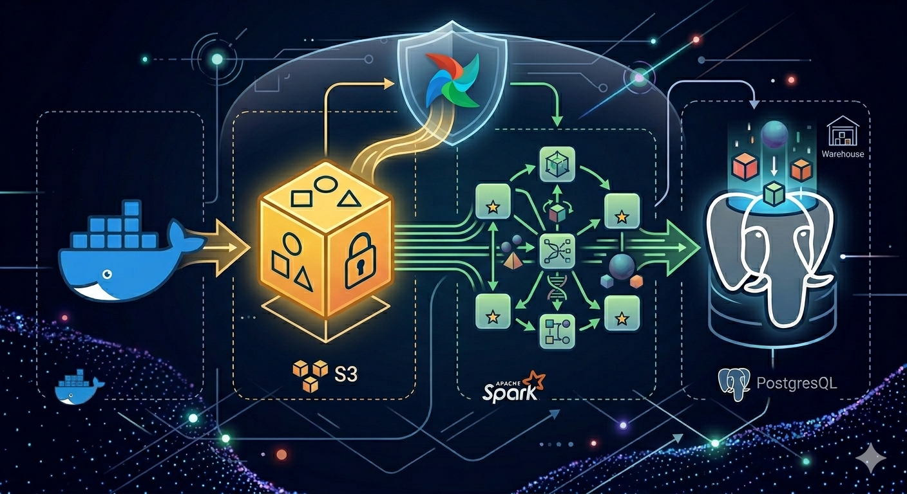

<div style="background-color:#fff8e7; color:#2b2b2b; padding:20px; border-radius:10px;">

# 🚀 s3-spark-pg-etl: End-to-End Containerized Data Pipeline



An automated, containerized ETL (Extract, Transform, Load) pipeline orchestrated by `Apache Airflow`. The project generates mock "dirty" data, uploads them to `AWS S3,` processes and cleans them using `PySpark`, and performs a high-performance bulk load into `PostgreSQL`.

---

## 🏗️ Architecture Overview

The data flows through the pipeline in three main stages, all orchestrated by Airflow:

1. **Ingestion (Python & Boto3):** Generates 100 rows of synthetic dirty data using Faker and uploads the raw CSV to AWS S3. The S3 bucket is created if it doesn't exist. 
2. **Transformation (PySpark & SparkSubmitOperator):** Spark pulls the raw CSV from S3, applies schema validation, cleans the data, performs Feature Engineering (MD5 Hashing), and saves it locally. Once done, it cleans up and deletes the S3 bucket.
3. **Loading (Python & Psycopg2):** Performs an efficient bulk insert using execute_values into PostgreSQL with an Upsert logic (ON CONFLICT DO NOTHING).

> **Note on Production vs Local Testing:** In a standard Cloud Production environment, Spark would read directly from S3 using s3a/s3n protocols and write directly to the database via a JDBC connector. For local testing, isolation, and cost-efficiency purposes, this pipeline downloads the data locally to clearly separate and monitor the three distinct ETL stages.

---

## 🗄️ Database Architecture: Local vs Production Mindset

For this project, we spin up a **single PostgreSQL container** acting as a unified database instance. However, inside this instance, we create two completely isolated logical databases to simulate a real-world enterprise environment:

1. **POSTGRES_DB (airflow):** Dedicated solely to Airflow's internal metadata (DAG runs, task states, triggers).
2. **TARGET_DB (user_data):** Our analytics data warehouse where the cleaned Spark data is loaded.

> **Why this design?**
> * **Local Efficiency:** Running one Postgres container saves RAM and CPU on local machines compared to spinning up two heavy database servers.
> * **Production Ready:** In a real cloud production environment (e.g., AWS RDS), these two would be **physically separated servers with different endpoints and credentials** for maximum security and performance isolation. If you want to move to production, you just change the `DB_HOST` in the `.env` file—no code changes required!

---

## 🔐 Security & AWS IAM Configuration

To run this pipeline, it is highly recommended to create a dedicated IAM User in AWS instead of using your Root Account.

* **Create a new IAM User:** Go to AWS IAM and create a user (e.g., s3-spark-airflow-worker).
* **Access Keys:** Generate an Access Key ID and Secret Access Key for this user.
* **IAM Policy:** Attach a policy granting programmatic access ONLY to S3 (AmazonS3FullAccess) to ensure the Principle of Least Privilege.
* **Environment:** Place these keys safely in your .env file (Gitignored).

---

## 🗂️ Project Structure

The repository is organized following standard Data Engineering folder conventions:
```text
s3-spark-pg-etl/
├── dags/             # Airflow DAG definition (TaskFlow API)
├── data/             # Local staging area for CSV files (Gitignored)
├── images/           # Banners and architecture diagrams
├── infra/            # Docker Compose & Custom Dockerfiles
│   └── docker-compose.yml
├── logs/             # Airflow logs
├── scripts/          # Python & PySpark ETL scripts
├── .env              # Environment variables and credentials
├── .gitignore        # Standard python & environment gitignore
├── LICENSE           # Project license
└── README.md         # Documentation
```
---

## 🛠️ Tech Stack & Prerequisites

| Technology | Purpose | Key Libraries Used |
| :--- | :--- | :--- |
| Apache Airflow 2.9.1 | Pipeline Orchestration | TaskFlow API, SparkSubmitOperator |
| Apache Spark 3.5.2 | Distributed Processing & Cleaning | pyspark, pyarrow |
| AWS S3 / Boto3 | Cloud Object Storage | boto3, botocore |
| PostgreSQL 13 | Target Relational Database | psycopg2-binary, execute_values |
| Docker & Compose | Multi-container Infrastructure | CeleryExecutor, Redis Broker |

**Prerequisites:**
* Docker and Docker Compose installed.
* Python 3.12+ (for local development).
* AWS S3 bucket access credentials.

---

## ⚙️ Installation & Setup

Follow these steps to run the pipeline locally on your machine:

**1. Clone the repository**
```bash
git clone https://github.com/your-username/s3-spark-pg-etl.git
cd s3-spark-pg-etl
```

**2. Configure Environment Variables**
Navigate to the root directory and create a .env file based on your credentials:

```bash
# === 🗄️ PostgreSQL Instance Settings (Database) ===
DB_USER=your_db_user
DB_PASS=your_db_password
DB_HOST=airflow-docker-postgres-1
DB_PORT=5432

# === 🎯 Databases ===
POSTGRES_DB=airflow           # Airflow Internal Metadata
TARGET_DB=user_data           # Your cleaned analytics data
DEFAULT_DB=postgres

# === 🌐 Airflow Web UI Admin ===
AIRFLOW_ADMIN_USER=your_web_admin_user
AIRFLOW_ADMIN_PASSWORD=your_web_admin_password
AIRFLOW_ADMIN_EMAIL=admin@example.com

# === 📊 PgAdmin UI Credentials ===
PGADMIN_MAIL=admin@example.com
PGADMIN_PASS=your_pgadmin_password

# === ☁️ AWS S3 Configuration ===
AWS_ACCESS_KEY_ID=YOUR_AWS_ACCESS_KEY_ID
AWS_SECRET_ACCESS_KEY=YOUR_AWS_SECRET_ACCESS_KEY
AWS_DEFAULT_REGION=eu-central-1
S3_BUCKET_NAME=your-s3-bucket-name
S3_FILE_KEY=raw/dirty-data.csv

# === 📂 Local Staging Paths ===
LOCAL_DIRTY_PATH=/opt/airflow/data/dirty_data.csv
LOCAL_CLEAN_FOLDER=/opt/airflow/data/clean_data
LOCAL_CLEAN_PATH=/opt/airflow/data/clean_data.csv

# === 🐳 Docker Container Permissions ===
AIRFLOW_UID=1000
AIRFLOW_GID=0
```

**3. Build and Spin Up Docker Containers**  
Run the Docker Compose setup from the root of the project by explicitly defining the path to both the `.env` file and the compose file:
```bash
docker compose --env-file .env -f infra/docker-compose.yml up --build -d
```

*Note: The init.sh entrypoint script will automatically run airflow db init, create the Airflow admin user using the credentials defined in your .env file, and set up the healthchecks!*

---

## 📊 ETL Pipeline Breakdown

**1. Data Contract & Cleaning (PySpark)**

The transformation step strictly enforces a data contract using Spark's StructType and performs a thorough data preparation:

* **Schema Enforcement:** Uses StructType to force strict data types upon reading the CSV file.
* **Standardization:** Trims whitespaces from all string columns (Name, Email, Phone, Zip Code, City).
* **Type Casting:** Converts the Age column from String to IntegerType.
* **Advanced Filtering (Regex & Nulls):**
  - Drops rows with null or empty names and cities.
  - Filters emails using strict regex validation.
  - Ensures standard structure for Greek mobile phones (starting with 69 and followed by 8 digits).
  - Keeps only 5-digit zip codes.
  - Keeps only realistic adult ages (between 18 and 99 years old).
* **Column Pruning & Feature Engineering:**
  - Drops the original auto-generated ID column.
  - Generates a deterministic surrogate user_id using an MD5 hash (name || email || phone).
* **Data Reshaping:** Reorders columns to a clean, predefined desired layout.
* **File I/O & Sharding Management:** Uses coalesce(1) to efficiently reduce partitions without a full network shuffle, producing a single unified output CSV file. It then cleans up Spark's temporary directory and renames the final output.

**2. PostgreSQL Bulk Ingestion**
Instead of iterative INSERT statements, the loading script uses psycopg2's cursor extension for optimal performance using execute_values. It uses an ON CONFLICT (user_id) DO NOTHING logic to avoid duplicate entries.

---

## 📈 Monitoring UIs

Once docker-compose is up, you can monitor the setup using the following ports:

| Service | URL | Credentials |
| :--- | :--- | :--- |
| **Airflow Webserver** | http://localhost:8088 | Defined in `.env` (Default: airflow / airflow) |
| **Spark Master WebUI** | http://localhost:8080 | No Authentication (Local Testing) |
| **pgAdmin** | http://localhost:5050 | Defined in `.env` (`PGADMIN_MAIL` / `PGADMIN_PASS`) |

*Tip: Always use your `.env` file to change default passwords before deploying to any shared environment!*

## 📊 Pipeline Execution & Monitoring

### Successful Airflow DAG Run
This screenshot from the Apache Airflow Graph View shows the successful completion of the entire ETL pipeline. All three tasks (`run_ingestion`, `spark-clean-task`, `run_loading`) are marked with the `success` state.


*(Timestamped: 2026-03-23, 06:05:39 UTC)*


### Data Validation: Raw S3 (Athena) vs Cleaned DB (pgAdmin)

To prove the pipeline’s cleaning capabilities, we compare the raw data in S3 with the final structured data loaded into PostgreSQL. Out of the 100 raw generated rows, the PySpark engine filtered out the noise and kept only the 14 valid records!

In the screenshots below, we can trace common valid rows (such as `Wendy Christian`, `Caroline Nelson`, and `Mark Anthony`) that successfully passed all of Spark's validation rules.

**☁️ 1. Raw Data State in AWS S3 (via Amazon Athena)**
Using Amazon Athena, we run SQL queries directly on top of the S3 CSV files. As seen in the screenshot, the raw dataset contains "noise" such as whitespaces, negative ages, invalid emails, and empty fields:


**🐘 2. Cleaned & Structured Data State (via pgAdmin)**
After PySpark processes the data, it is loaded into PostgreSQL. Running the same query in pgAdmin proves that the anomalies were dropped! Spark cast data types correctly, kept valid emails/ages, and generated deterministic `user_id` hashes:


