<p align="center">
  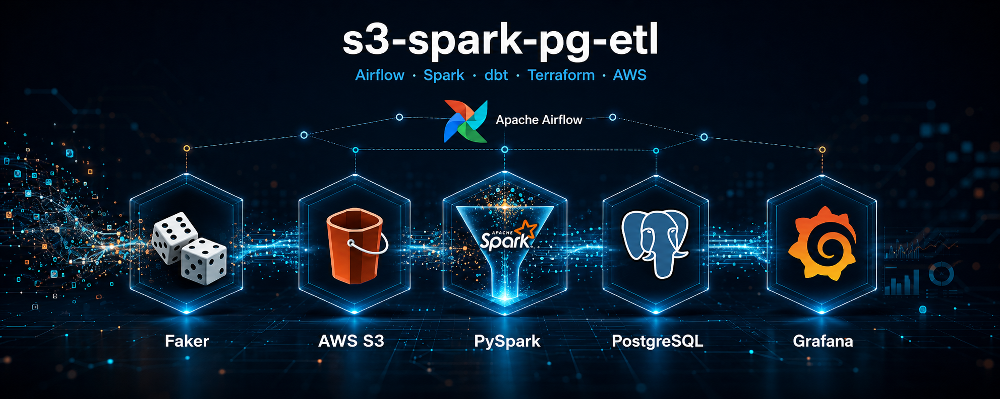
</p>

# Contract-Driven Data Pipeline

<p align="center">
  <a href="https://github.com/theofanis-tsakanikas/contract-driven-data-pipeline/actions/workflows/ci.yml"></a>
  <a href="LICENSE"></a>
  
  
  <br>
  
  
  
  
  
  <br>
  
  
  
</p>

**An ETL platform where one declared data contract is the single source of truth — it decides what is
accepted, why a row was rejected, which fields are PII, and what the data dictionary says.**
*Airflow · PySpark · AWS S3 · PostgreSQL · dbt · Terraform · Glue + Athena · Grafana · Streamlit*

> **On the names.** The repository is `contract-driven-data-pipeline`; the Airflow `dag_id` stays
> `s3-to-postgres-etl` and the AWS resources keep `project_name = s3-spark-pg-etl`. Renaming those
> would mean destroying and recreating the deployed bucket, IAM user, Glue crawler and Athena
> workgroup — so the original identifiers were kept deliberately.

---

## The problem

A pipeline that silently drops bad rows is worse than one that fails. The rows disappear, the counts
never reconcile, and nobody can answer the only question that matters in an audit: *which records
never made it into the warehouse, and why?* The usual answer is validation logic scattered across a
Spark job, a loader, a dashboard and a wiki page — four places that disagree within a month.

Here the validation rules, the rejection reasons, the PII classification and the published data
dictionary are all generated from **one declared contract** ([`scripts/data_contract.py`](scripts/data_contract.py)).
Rejected rows are quarantined with the exact rule they violated, a per-run quality report is emitted
as metrics and written back to the lake, and CI fails if the committed data dictionary drifts from
the contract by a single byte.

## Status

The full stack runs end to end from a single DAG trigger: **1,000 synthetic dirty rows** generated
per run, uploaded to the S3 raw zone, validated against the contract in PySpark, bulk-upserted into
PostgreSQL, and modelled by dbt into two marts — with all five tasks green and a `run_dbt_test` gate
that fails the DAG rather than publish broken marts.

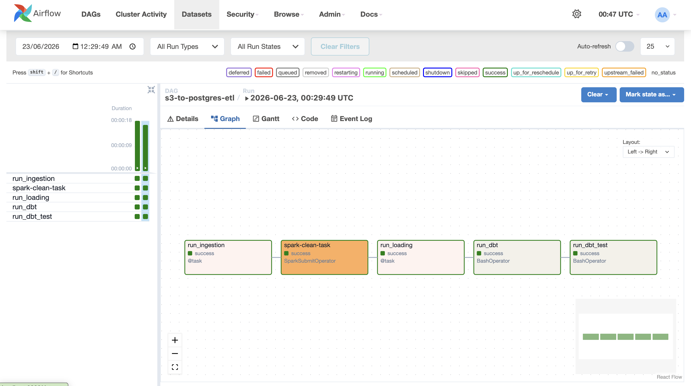

<sub><b>One run, five tasks, all <code>success</code></b> — <code>run_ingestion → spark-clean-task → run_loading → run_dbt → run_dbt_test</code>. The last task is a gate: if the dbt schema tests fail, the DAG fails and the marts are not published.</sub>

The AWS side (bucket + lifecycle, least-privilege IAM, Glue crawler, Athena workgroup) is provisioned
by Terraform through a manual GitHub Actions button authenticated with OIDC — **no long-lived AWS
keys are stored in CI**. The local stack runs entirely on Docker, including on Apple Silicon.

---

## Contents

- [The problem](#the-problem) · [Status](#status) · [Architecture](#architecture)
- [The contract at work](#the-contract-at-work) · [Data quality you can see](#data-quality-you-can-see)
- [Analytics and BI](#analytics-and-bi) · [The data lake](#the-data-lake)
- [Infrastructure — two planes](#infrastructure--two-planes) · [Security and IAM](#security-and-iam)
- [Quickstart](#quickstart) · [Testing](#testing) · [Repository layout](#repository-layout)
- [What this does not do](#what-this-does-not-do) · [Cost](#cost) · [Decisions](#decisions)
- [Docs](#docs) · [Security](#security) · [License](#license)

---

## Architecture

Five Airflow tasks, one contract, three consumers. The dotted arrows map each task to the stage it
drives; the solid ones are the data.

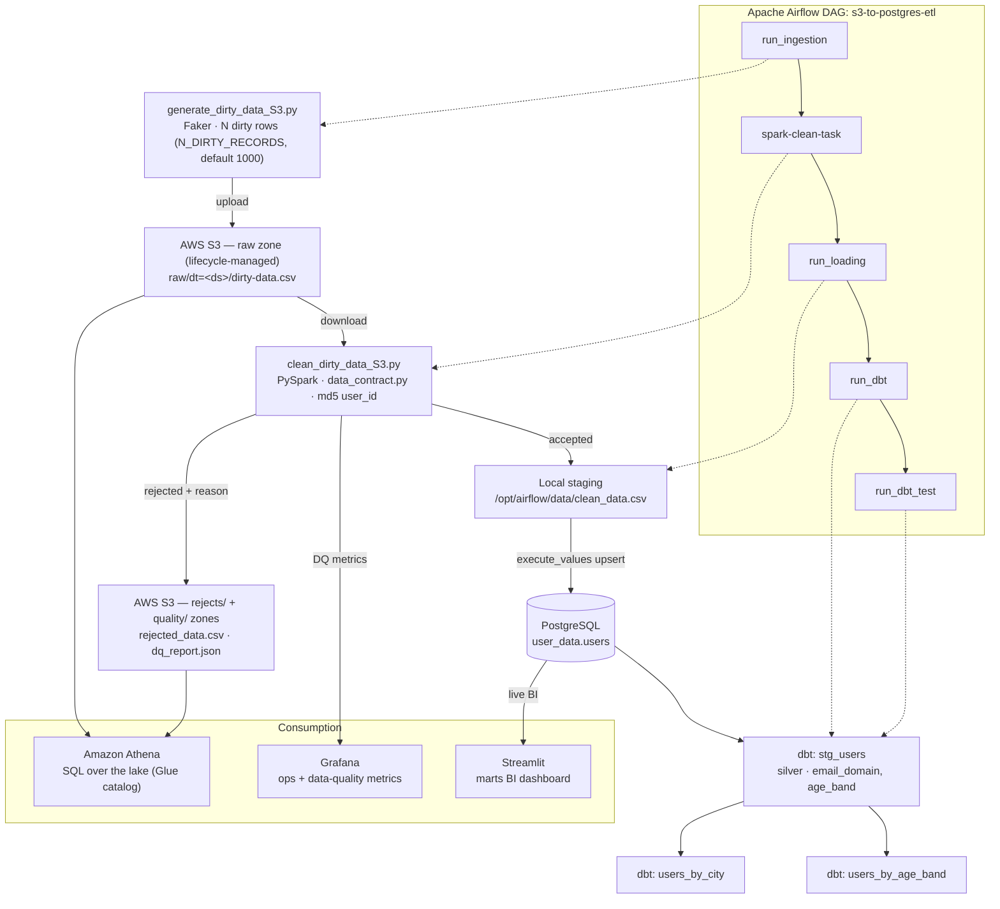
```mermaid
flowchart TD
    subgraph AF["Apache Airflow DAG: s3-to-postgres-etl"]
        direction LR
        T1["run_ingestion"] --> T2["spark-clean-task"] --> T3["run_loading"] --> T4["run_dbt"] --> T5["run_dbt_test"]
    end

    GEN["generate_dirty_data_S3.py<br/>Faker · N dirty rows (N_DIRTY_RECORDS, default 1000)"]
    S3["AWS S3 — raw zone (lifecycle-managed)<br/>raw/dt=&lt;ds&gt;/dirty-data.csv"]
    SPARK["clean_dirty_data_S3.py<br/>PySpark · data_contract.py · md5 user_id"]
    CSV["Local staging<br/>/opt/airflow/data/clean_data.csv"]
    REJ["AWS S3 — rejects/ + quality/ zones<br/>rejected_data.csv · dq_report.json"]
    PG[("PostgreSQL<br/>user_data.users")]
    STG["dbt: stg_users<br/>silver · email_domain, age_band"]
    M1["dbt: users_by_city"]
    M2["dbt: users_by_age_band"]

    subgraph CONS["Consumption"]
        ATH["Amazon Athena<br/>SQL over the lake (Glue catalog)"]
        GRAF["Grafana<br/>ops + data-quality metrics"]
        ST["Streamlit<br/>marts BI dashboard"]
    end

    GEN -->|upload| S3
    S3 -->|download| SPARK
    SPARK -->|accepted| CSV
    SPARK -->|rejected + reason| REJ
    SPARK -->|DQ metrics| GRAF
    CSV -->|execute_values upsert| PG
    PG --> STG
    STG --> M1
    STG --> M2
    S3 --> ATH
    REJ --> ATH
    PG -->|live BI| ST

    T1 -.-> GEN
    T2 -.-> SPARK
    T3 -.-> CSV
    T4 -.-> STG
    T5 -.-> STG
```

The contract sits at the centre of `spark-clean-task`: the accept filter, the `rejection_reason`
values, the PII classification and [`docs/governance/DATA_DICTIONARY.md`](docs/governance/DATA_DICTIONARY.md)
are all derived from it, so they cannot disagree.

<details>
<summary><b>Why Spark stages through the local filesystem instead of reading S3 directly</b></summary>

<br>

In a cloud deployment Spark would read from S3 over `s3a://` and write to the database over JDBC. This
pipeline deliberately downloads to a local staging path between stages so the three ETL phases stay
separately observable and cheap to run on a laptop. It is a demo trade-off, not a recommendation —
see [What this does not do](#what-this-does-not-do).

Similarly, Spark defaults to in-process `local[*]`, which is reliable on every architecture including
arm64. The standalone `spark-master` / `spark-worker` services exist and are opt-in via `SPARK_MASTER`.

</details>

---

## The contract at work

The headline of the project: every row is validated against **six declared rules** — non-empty name
and city, regex-validated email, Greek mobile (`69` + 8 digits), 5-digit postcode, and adult age in
`[18, 99]`. The generator produces deliberately filthy data, so a typical run accepts only **~16–19%**
of rows — and the other ~81% are **not lost**. Each is quarantined and tagged with the first rule it
violated.

<table>
<tr>
<td width="50%">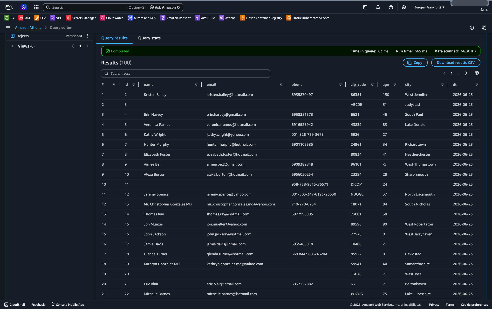<br><sub><b>Before</b> — the raw zone, queried in place with Athena: leading whitespace, negative and impossible ages, malformed emails, empty fields.</sub></td>
<td width="50%">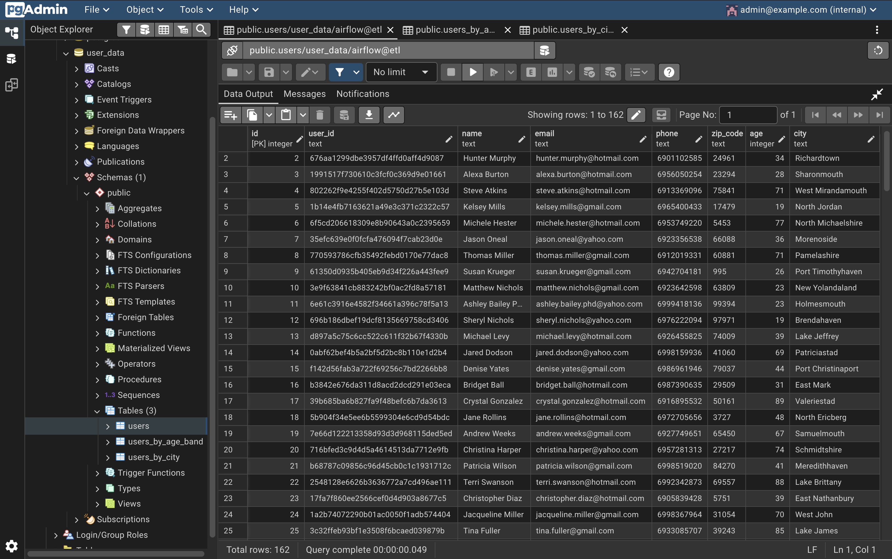<br><sub><b>After</b> — the warehouse table: valid rows only, cast types, and a deterministic MD5 <code>user_id</code> in place of the natural key.</sub></td>
</tr>
</table>

Three properties are worth noticing in that pair:

- **Rejected-row provenance.** Failing rows go to a `rejects/` output carrying `rejection_reason`,
  so any record missing from the warehouse is traceable to *why* — not merely absent.
- **PII made explicit.** Direct identifiers (name, email, phone) are never stored as a key: the loaded
  `user_id` is a deterministic MD5 pseudonym of `name || email || phone`. Fields are classified as
  direct- or quasi-identifier at the data layer, and the data dictionary is generated from that
  classification.
- **The dictionary cannot drift.** CI runs `python scripts/data_contract.py --check` and fails the
  build if [`docs/governance/DATA_DICTIONARY.md`](docs/governance/DATA_DICTIONARY.md) no longer matches
  the declared rules.

---

## Data quality you can see

Not *whether* the pipeline ran, but *how good the data was*. The Spark task emits `airflow.dq.*`
gauges (accept rate, accepted/rejected counts, rejections by reason) through StatsD → Prometheus →
a provisioned Grafana dashboard, and writes the same summary to the lake as `dq_report.json` where
Athena can query its history.

<table>
<tr>
<td width="50%">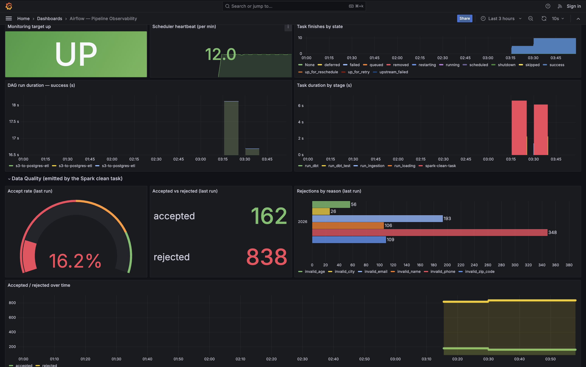<br><sub><b>Grafana — live</b>: the accept-rate gauge, rejections broken down by reason, and per-task / per-DAG-run durations, all provisioned as code.</sub></td>
<td width="50%">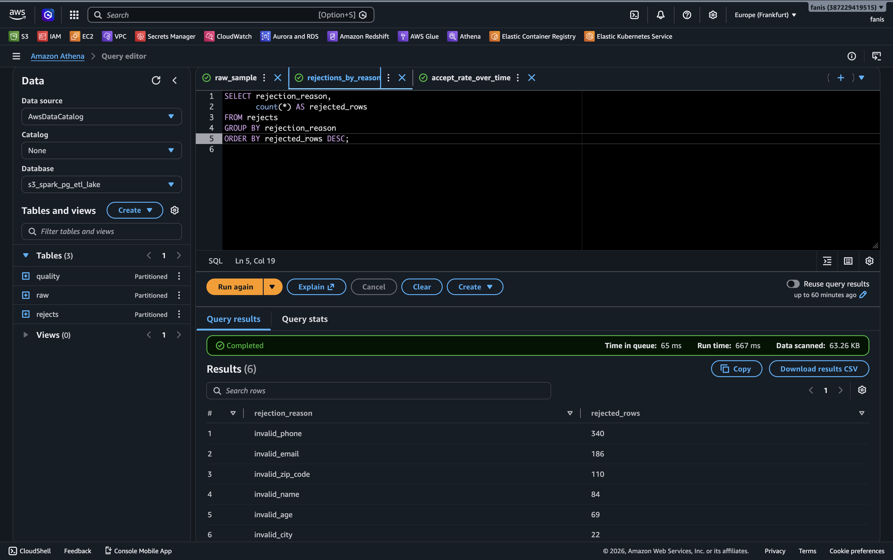<br><sub><b>Athena — historical</b>: <code>rejections_by_reason</code> as plain SQL over the <code>quality/</code> and <code>rejects/</code> zones, catalogued by the Glue crawler.</sub></td>
</tr>
</table>

The same numbers in two places with two lifetimes: Grafana answers *how is the run doing right now*,
Athena answers *how has quality moved across every run we ever kept*.

---

## Analytics and BI

`run_dbt` builds the silver/marts layer — `stg_users` (a view adding `email_domain` and `age_band`)
feeding `users_by_city` and `users_by_age_band` — and `run_dbt_test` runs the schema tests as a gate.
A Streamlit app reads the marts, either live from PostgreSQL or from a self-contained demo dataset.

<table>
<tr>
<td width="50%">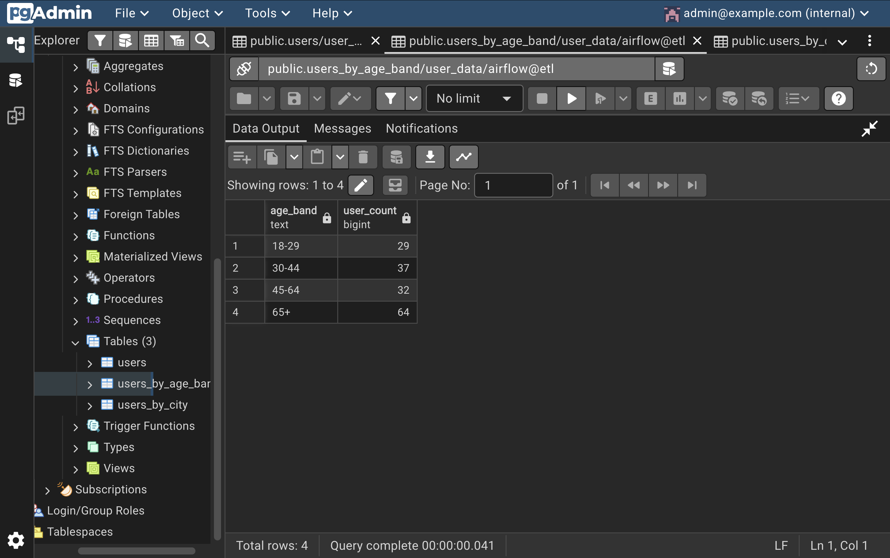<br><sub><b>The marts</b> — <code>users_by_age_band</code> and <code>users_by_city</code>, built and tested by dbt in an isolated venv so its pins never clash with Airflow's.</sub></td>
<td width="50%">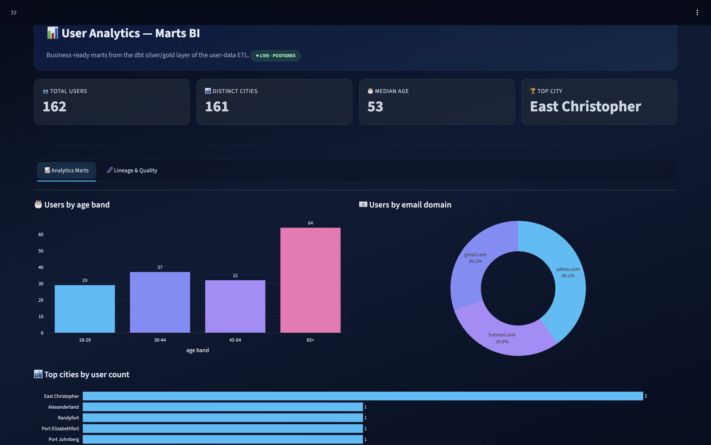<br><sub><b>The BI layer</b> — age bands, email domains and top cities over the warehouse; <code>make app</code> launches it on <code>:8501</code>.</sub></td>
</tr>
</table>

---

## The data lake

Three date-partitioned zones — `raw/`, `rejects/` and `quality/` — give an auditable history rather
than a single overwritten file. The raw zone is governed by a Terraform lifecycle rule
(`expire-raw-zone`, default 30 days) so an every-run history does not grow unbounded.

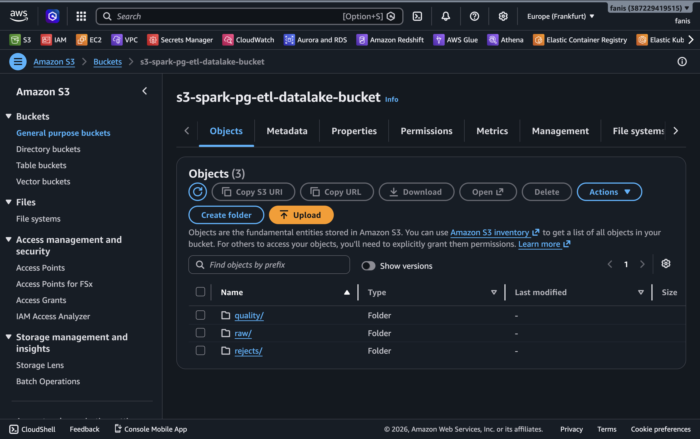

<sub><b>The lake, per run</b> — <code>raw/dt=&lt;ds&gt;/</code> holds what arrived, <code>rejects/dt=&lt;ds&gt;/</code> what was refused and why, <code>quality/dt=&lt;ds&gt;/</code> the run's quality summary. Glue catalogues all three so Athena reads them as tables.</sub>

---

## Infrastructure — two planes

The **control plane** (provisioning) and the **data plane** (running the ETL) are deliberately
separate: they have different lifecycles, different credentials and different triggers. Terraform and
GitHub Actions provision; Airflow runs. The ETL is never executed from CI.

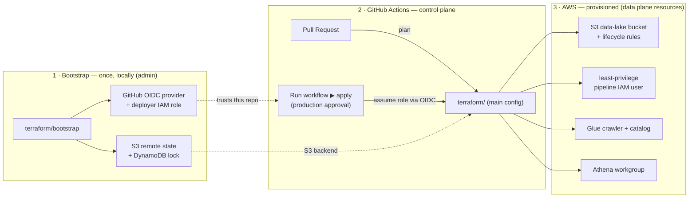
```mermaid
flowchart LR
    subgraph BOOT["1 · Bootstrap — once, locally (admin)"]
        TFB["terraform/bootstrap"]
        TFB --> STATE["S3 remote state<br/>+ DynamoDB lock"]
        TFB --> OIDC["GitHub OIDC provider<br/>+ deployer IAM role"]
    end

    subgraph GH["2 · GitHub Actions — control plane"]
        PR["Pull Request"] -->|plan| TF["terraform/ (main config)"]
        BTN["Run workflow ▶ apply<br/>(production approval)"] -->|assume role via OIDC| TF
    end

    subgraph AWS["3 · AWS — provisioned (data plane resources)"]
        BUCKET["S3 data-lake bucket<br/>+ lifecycle rules"]
        IAM["least-privilege<br/>pipeline IAM user"]
        GLUE["Glue crawler + catalog"]
        ATHENA["Athena workgroup"]
    end

    OIDC -. trusts this repo .-> BTN
    STATE -. S3 backend .-> TF
    TF --> BUCKET & IAM & GLUE & ATHENA
```

Every PR touching `infra/terraform/**` is checked **offline** — `terraform fmt -check` plus
`init -backend=false` and `validate`, with no credentials and no backend — and then gets a read-only
`plan` **when the estate is up**. When it is torn down (its normal resting state) the plan step
reports the unset variables with a `::notice::` and the job stays green, because a permanently red
check is a check nobody reads. The `apply` is a manual *Run workflow* button gated by the
`production` environment's approval, and it **refuses to run** with those variables unset rather than
skipping quietly.

## Security and IAM

The pipeline's AWS identity is managed by Terraform ([`infra/terraform/iam.tf`](infra/terraform/iam.tf)) —
it is never created by hand.

- **Least-privilege pipeline user.** Its policy allows only `s3:ListBucket` on the data-lake bucket
  and `s3:GetObject` / `s3:PutObject` on its objects. No `CreateBucket`, no `DeleteObject`, no access
  to anything else.
- **Two distinct identities.** The *pipeline* user (reads/writes objects) is separate from the
  *deployer* role (provisions infrastructure). Neither is ever reused for the other's job.
- **No stored keys in CI.** The Terraform workflow authenticates via **OIDC** against a deployer role
  created by the one-time bootstrap. Its trust policy uses `StringEquals` on exactly three subjects —
  `pull_request`, `ref:refs/heads/main` and `environment:production` — rather than the usual
  `repo:<repo>:*`, so a workflow on a feature branch is refused by AWS, not merely by convention.
- **Secret scanning.** `gitleaks` runs on every push and pull request, over the **full git history**.
- **Loopback only.** Every published port in `docker-compose.yml` is bound to `127.0.0.1`, so the
  local stack is not reachable from the network even on an untrusted one.

Access keys for local runs come from `terraform output pipeline_access_key_id` /
`pipeline_secret_access_key` and live only in the gitignored `.env`.

---

## Quickstart

Requires Docker + Docker Compose, Python 3.12 for local development, and an AWS account with
Terraform and the AWS CLI for the cloud side.

```bash
# 1. Clone
git clone https://github.com/theofanis-tsakanikas/contract-driven-data-pipeline.git
cd contract-driven-data-pipeline

# 2. Provision the AWS side (once with admin creds, then the main config)
make bootstrap-apply    # remote state bucket + DynamoDB lock + GitHub OIDC deployer role
make tf-apply           # data-lake bucket + least-privilege IAM + Glue + Athena
make tf-output          # prints S3_BUCKET_NAME + the pipeline AWS keys for .env

# 3. Configure
cp .env.example .env    # then fill in the AWS values from `make tf-output`

# 4. Bring the stack up and run the pipeline
make up                 # Airflow, Postgres, Spark, pgAdmin, Prometheus, Grafana
make run                # trigger one DAG run (same as pressing ▶ in the UI)

# 5. Explore the results
make crawler            # catalogue the S3 lake so Athena can query it
make app                # Streamlit marts dashboard → http://localhost:8501
```

Run `make` with no target to list every shortcut. The only `.env` values that need thought are
`S3_BUCKET_NAME` (globally unique), the two `AWS_*` keys, and `N_DIRTY_RECORDS` (default 1000 — lower
it for a quicker demo). Everything else has a working default in
[`.env.example`](.env.example); passwords there are `change_me` placeholders and should be changed
before any shared environment.

**The UIs**

| Service | URL | Credentials |
|---|---|---|
| Airflow | http://localhost:8088 | `AIRFLOW_ADMIN_USER` / `AIRFLOW_ADMIN_PASSWORD` |
| Grafana — pipeline + data quality | http://localhost:3000 | `GRAFANA_USER` / `GRAFANA_PASS` |
| Streamlit — marts BI | http://localhost:8501 | `make app`, no auth |
| pgAdmin | http://localhost:5050 | `PGADMIN_MAIL` / `PGADMIN_PASS` |
| Prometheus | http://localhost:9090 | none |
| Spark master | http://localhost:8080 | none (local only) |

Athena lives in the AWS console — workgroup `s3-spark-pg-etl-wg`, database `s3_spark_pg_etl_lake`,
after `make crawler`.

---

## Testing

**63 tests** covering the pure logic: the contract's rules and PII classification, `clean_dataframe()`
(what is accepted), `rejected_dataframe()` (that every rejected row carries the first rule it
violated), `data_quality_report()`, the generator, the loader's edge cases, and DAG integrity.

```bash
make test        # pytest — PySpark transform, contract, loader, generator (needs Java 17+)
make lint        # ruff + the data-dictionary drift check
```

Nine of them guard the **dependency pins** rather than the code
([`tests/test_dependency_pins.py`](tests/test_dependency_pins.py)): that the Airflow version in the
Dockerfile is the one CI actually validates against, and that packages pinned in both images carry
the same version. Those invariants used to live only in a comment, and automated dependency PRs
walked straight through them — including a base-image bump from Airflow 2.11 to 3.3 that passed all
five checks. Each guard was verified by breaking it on purpose and confirming it refuses.

56 of them run from a plain checkout; the 7 **DAG-integrity** tests need Airflow installed and run in
their own CI job. The suite starts a local `SparkSession` — it needs **no** running containers, no
Kafka, no AWS credentials, and never touches the cloud.

CI ([`.github/workflows/ci.yml`](.github/workflows/ci.yml)) runs four gates on every push and pull
request: **lint** (ruff + `data_contract.py --check`), **test** (PySpark on Java 17), **smoke** (loads
a CSV fixture into a real `postgres:16` service container and asserts the row count landed), and
**dag-validate** (DagBag integrity with Airflow and its providers installed). A separate
[`gitleaks.yml`](.github/workflows/gitleaks.yml) scans for secrets.

---

## Repository layout

| Path | Purpose |
|---|---|
| [`dags/`](dags/) | The Airflow DAG (TaskFlow API) — `dag_id: s3-to-postgres-etl`, `schedule=None` |
| [`scripts/`](scripts/) | ETL stages: generator, **`data_contract.py`** (the single source of truth), PySpark clean, loader |
| [`dbt/`](dbt/) | Silver/marts layer — `stg_users` → `users_by_city`, `users_by_age_band` |
| [`docs/adr/`](docs/adr/) | 7 decision records — what was chosen and what was rejected |
| [`docs/governance/`](docs/governance/) | **Generated** `DATA_DICTIONARY.md` (contract + PII classification); CI `--check` keeps it in sync |
| [`infra/`](infra/) | `docker-compose.yml`, arch-aware Airflow/Spark images, `observability/` (Prometheus + provisioned Grafana) |
| [`infra/terraform/`](infra/terraform/) | IaC — bucket + lifecycle, least-privilege IAM, Glue, Athena; `bootstrap/` = state + OIDC role |
| [`app/`](app/) | Streamlit marts BI dashboard (live PostgreSQL or self-contained demo) |
| [`tests/`](tests/) | 63 pytest tests — transform, contract, loader, generator, DAG integrity, dependency pins |
| [`.github/`](.github/) | `workflows/ci.yml` (4 gates) · `workflows/terraform.yml` (plan on PR, manual OIDC apply) · `workflows/gitleaks.yml` · `dependabot.yml` |
| `data/`, `logs/` | Runtime mounts — gitignored |

---

## What this does not do

- **Spark stages through the local filesystem, not `s3a://` and JDBC.** Each stage downloads and
  writes locally so the three ETL phases stay separately observable on a laptop. In a cloud
  deployment Spark would read S3 directly and write over JDBC — the transform logic is unchanged, the
  I/O wrapper is not.
- **Spark runs in-process (`local[*]`) by default.** The standalone master/worker services exist but
  are opt-in and need an amd64 host. Nothing here proves distributed execution.
- **One PostgreSQL container hosts two logical databases** (`airflow` metadata and `user_data`
  analytics). In production these would be separate servers with separate endpoints and credentials —
  changing `DB_HOST` is the only code-free step, but that separation has not been exercised.
- **The source data is synthetic.** Faker generates the dirty rows; there is no real upstream system,
  and the ~16–19% accept rate is a property of the generator, not a measured production figure.
- **The DAG has no schedule.** `schedule=None`, manual trigger only — there is no cron, no SLA, no
  backfill story.
- **The marts are minimal.** Two aggregate tables over one staging view. This demonstrates the
  contract and the lineage, not analytics-engineering depth.
- **The pipeline authenticates with a long-lived IAM access key**, and no image or dependency
  vulnerability scanning runs in CI. These and six more are stated in full, each with the control a
  deployment would use instead, in [SECURITY.md](SECURITY.md#known-limitations).

---

## Cost

**Effectively under $1/month at demo scale, and $0 when torn down.** The whole local stack — Airflow,
Spark, PostgreSQL, Prometheus, Grafana, pgAdmin — runs in Docker on your machine and costs nothing.

The AWS footprint is deliberately small and has no always-on compute:

| Resource | What drives the cost |
|---|---|
| S3 data lake | A few MB per run across `raw/` + `rejects/` + `quality/`; the raw zone expires after 30 days by lifecycle rule |
| Glue crawler | On demand only (`make crawler`), billed per DPU-hour with a 10-minute minimum |
| Athena | Per TB scanned — fractions of a cent at this data size; query results expire on their own lifecycle rule |
| IAM user / role, Athena workgroup | Free |

`terraform destroy` in [`infra/terraform/`](infra/terraform/) returns it to zero; the bootstrap layer
(state bucket, lock table, OIDC role) is intentionally kept.

---

## Decisions

Seven decision records in [`docs/adr/`](docs/adr/) — what was chosen and, more usefully, what was
rejected and why.

| | Decision | Rejected |
|---|---|---|
| [0001](docs/adr/0001-one-declared-data-contract.md) | One declared contract drives validation, rejection reasons, PII classification and the data dictionary | Great Expectations / Soda · documentation by convention |
| [0002](docs/adr/0002-quarantine-rejected-rows.md) | Rejected rows are quarantined with the rule they violated, never dropped | Fail the run on bad data · log-and-move-on |
| [0003](docs/adr/0003-md5-surrogate-key.md) | An MD5 surrogate key, so no direct identifier is ever a primary key | Email as PK · UUID (breaks idempotency) · HMAC (needs a managed key) |
| [0004](docs/adr/0004-terraform-provisions-the-bucket.md) | Terraform creates the bucket; the pipeline holds no `s3:CreateBucket` and no `s3:DeleteObject` | `create_bucket()` at runtime · a console-created bucket |
| [0005](docs/adr/0005-control-plane-and-data-plane-are-separate.md) | Terraform provisions, Airflow runs; the ETL is never triggered from CI | ETL in GitHub Actions · apply-on-merge · a cron schedule |
| [0006](docs/adr/0006-in-process-spark-by-default.md) | In-process `local[*]` Spark by default; the standalone cluster is opt-in | Cluster as default (fails on arm64) · QEMU emulation |
| [0007](docs/adr/0007-dbt-in-an-isolated-venv.md) | dbt in its own virtualenv, invoked by absolute path | `dbt-postgres` in the Airflow requirements · a separate container · Cosmos |

Two choices were deliberately **not** given an ADR — the single Postgres container hosting two logical
databases, and `coalesce(1)` on the outputs. Both are local conveniences without a real trade-off;
[`docs/adr/README.md`](docs/adr/README.md) says so rather than padding the ledger.

One more, recorded here because it is about the repository rather than the design: the `dag_id` and
`project_name` still say `s3-spark-pg-etl` after the rename, because renaming them would destroy and
recreate the live bucket, IAM user, crawler and workgroup for a cosmetic gain.

---

## Docs

[DATA_DICTIONARY](docs/governance/DATA_DICTIONARY.md) — generated from the contract, CI-checked ·
[docs/adr/](docs/adr/) — 7 decision records ·
[infra/terraform/README](infra/terraform/README.md) — bootstrap, backend and the OIDC apply button ·
[SECURITY](SECURITY.md) · [CHANGELOG](CHANGELOG.md)

Engineering reference — service ports, connections-as-code, known failure modes and gotchas — is in
[`CLAUDE.md`](CLAUDE.md).

## Security

The hardened controls, the eight known limitations and what a real deployment would do instead:
[SECURITY.md](SECURITY.md). The short version — two IAM identities that are never interchanged, no
long-lived AWS key in CI, gitleaks over the full history, every local port bound to loopback, and an
honest statement that the MD5 key is pseudonymisation rather than anonymisation.

## License

[MIT](LICENSE) © 2026 Theofanis Tsakanikas
